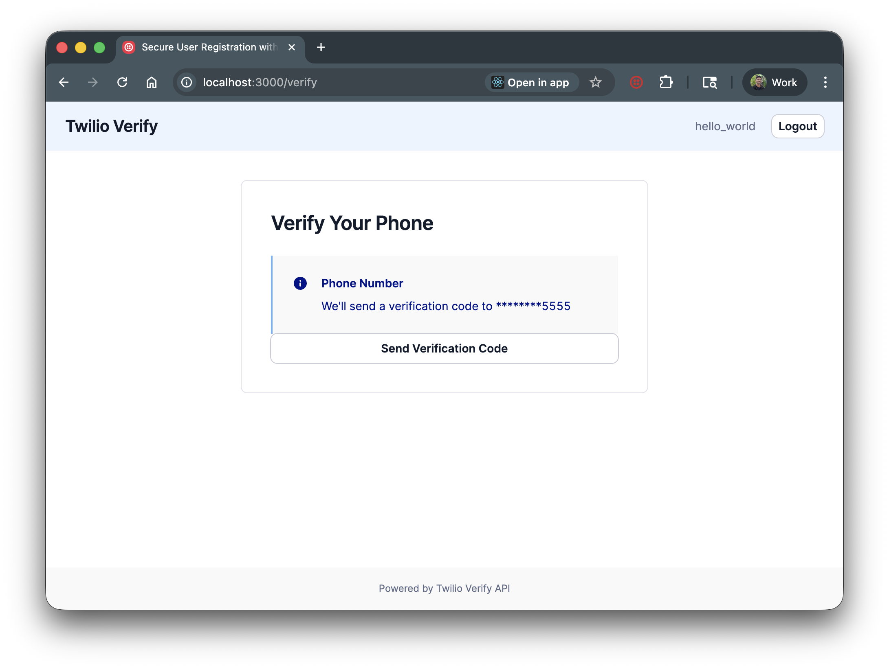

# Build a User Registration System with SMS Phone Verification

An ASP.NET Core MVC application with user registration, authentication, and SMS phone verification using Twilio Verify. Users create an account, verify their phone number via OTP, and access protected content.




## Features

- 📱 SMS and voice-based phone verification
- 🔐 User registration with secure password storage
- ✅ Phone number verification flow
- 🎨 Modern UI built with Twilio Paste design system
- 💾 SQLite database with Entity Framework Core

## Set up

### Requirements

- [.NET SDK](https://dotnet.microsoft.com/download) 10.0+
- [A Twilio Verify Service](https://console.twilio.com/?frameUrl=/console/verify/services)

### Twilio Account Settings

| Config Value | Description |
| :----------- | :---------- |
| TWILIO_ACCOUNT_SID | Your Twilio Account SID from the [Console](https://www.twilio.com/console) |
| TWILIO_AUTH_TOKEN | Your Twilio Auth Token from the [Console](https://www.twilio.com/console) |
| TWILIO_VERIFICATION_SID | Create a Verify Service [here](https://www.twilio.com/console/verify/services) |

### Local development

1. Clone this repository and `cd` into it.

   ```bash
   git clone git@github.com:twilio-samples/sms-phone-verification-csharp.git
   cd sms-phone-verification-csharp/VerifyV2Quickstart
   ```

2. Install dependencies.

   ```bash
   dotnet build
   ```

3. Install EF Core CLI (if not already installed).

   ```bash
   dotnet tool install --global dotnet-ef
   ```

4. Set your environment variables.

   ```bash
   cp appsettings.Development.json.example appsettings.Development.json
   ```

   Edit `appsettings.Development.json` with your Twilio credentials.

5. Create the database.

   ```bash
   dotnet ef database update
   ```

6. Run the application.

   ```bash
   dotnet run
   ```

7. Open http://localhost:5000 to register an account and verify your phone number.

## Docker

If you have [Docker](https://www.docker.com/) already installed on your machine, you can use our `docker-compose.yml` to setup your project.

1. Make sure you have the project cloned.
2. Setup the `appsettings.Development.json` file as outlined in the [Local Development](#local-development) steps.
3. Run `docker-compose up`.

## Tests

You can run the tests locally by typing:

```bash
dotnet test
```

## Resources

- [Twilio Verify API Documentation](https://www.twilio.com/docs/verify/api)
- [Twilio C# SDK Documentation](https://www.twilio.com/docs/libraries/reference/twilio-csharp)
- [ASP.NET Core Documentation](https://docs.microsoft.com/aspnet/core)
- [SMS Phone Verification CodeExchange Page](https://www.twilio.com/code-exchange/sms-phone-verification)

## Contributing

This template is open source and welcomes contributions. All contributions are subject to our [Code of Conduct](https://github.com/twilio-labs/.github/blob/master/CODE_OF_CONDUCT.md).

## License

[MIT](http://www.opensource.org/licenses/mit-license.html)

## Disclaimer

No warranty expressed or implied. Software is as is.
